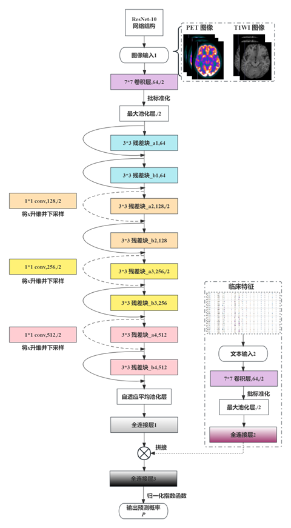

implementation of **Research on 18F-FDG PET/MRI multi-modal imaging in patients with temporal lobe epilepsy based on artificial intelligence technology** 

Abstract : A Transformer-based epilepsy survival analysis model was built. The postoperative 
early recurrence status of epilepsy patients is an important research area in epilepsy 
prognosis, and the development of this area has been unprecedentedly opportunity by the 
multi-modal data including pathological results, preoperative images, and clinical 
information. However, it has always been a challenge in survival analysis to obtain effective 
predictive features from these multi-modal data due to the high dimensionality and 
heterogeneity of image data. In this study, we propose a Transformer-based epilepsy 
recurrence prediction model （TransEpRelap） that can effectively integrate the modality internal and modality-inter features of preoperative structural and functional imaging and 
clinical information. The experimental results show that the proposed TransEpRelap 
outperforms existing methods and improves epilepsy prognosis prediction.

# Novelty

We have developed a Temporal Lobe Epilepsy Postoperative Short-term Recurrence Prediction Model based on the ResNet18 neural network. The model shows good discrimination and calibration for time-to-event survival analysis tasks.

# Clinical baseline data

A total of 220 patients with temporal lobe epilepsy were included and followed up postoperatively through outpatient visits, hospital admissions, or telephone interviews for at least 1 year. The postoperative recurrence of epilepsy was evaluated according to the Engel classification system proposed by the International League Against Epilepsy in 2001: Grade I: complete disappearance of seizures; Grade II: ≤ 3 seizures per year; Grade III: ≥ 90% reduction in seizures, significant improvement; Grade IV: < 90% reduction in seizures, no significant improvement. In this study, patients who met the criteria for Grade I according to the Engel classification were defined as having a good outcome, while patients with other grades were considered to have epilepsy recurrence.

The demographic and clinical baseline characteristics of the temporal lobe epilepsy (TLE) dataset are shown in Table 3.3. There were 220 TLE patients, with 132 males (60%) and 88 females (40%). The median follow-up time was 24 months, the median age at first seizure was 12 years (144 months), the median age at surgery was 23 years (276 months), and the median duration of epilepsy was 127 months.
There were no statistically significant differences between the recurrent and non-recurrent groups of TLE patients in terms of operative side, gender, age at surgery, age at onset of seizures, duration of epilepsy, seizure frequency, febrile seizures, secondary generalization, early brain injury, family history of epilepsy, hypoxia, central nervous system infection, history of head trauma, prior surgeries, or preoperative MRI results (p > 0.05). The only difference was in the follow-up time. Figure 3.3 visualizes the clinical features and follow-up information of the 220 TLE patients, with each row representing a clinical feature and each column representing an individual TLE patient.

# Network

# Results and Model Comparison for Recurrence Prediction of Epilepsy

# Install

    pip install -r requirements.txt

# Run
python main.py

